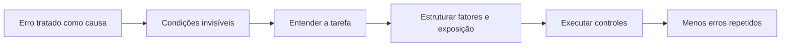
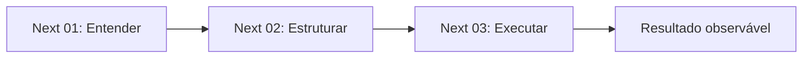

# O que é risco cognitivo?

## 1. Contexto
Quando um relatório sai com o número errado, a explicação costuma ser “erro humano” e o caso se encerra ali. Mas o erro foi o fim de uma sequência: prazo apertado, planilha copiada de outra versão, revisão feita entre duas reuniões. Olhar só para o erro chega tarde. Risco cognitivo é o nome que este blog usa para a possibilidade, anterior ao erro, de atenção, memória e julgamento contribuírem para um resultado indesejado. Ele existe antes de o número errado aparecer — e por isso pode ser observado e reduzido.

## 2. 5W2H

| Variável | Síntese |
|---|---|
| O que? | Possibilidade de a cognição contribuir para resultados indesejados. |
| Por quê? | Erros são analisados só depois que já causaram dano. |
| Onde? | Em tarefas que dependem de atenção, memória ou julgamento. |
| Quando? | Antes do evento, enquanto as condições ainda podem mudar. |
| Quem? | Pessoas, equipes e quem desenha o trabalho. |
| Como? | Observando condições do trabalho, não apenas falhas individuais. |
| Quanto? | Varia com a tarefa, o contexto e a criticidade. |

## 3. Referência padrão-ouro
Sidney Dekker é referência central para esta virada de olhar. Em *The Field Guide to Human Error Investigations* (2002), ele contrapõe a “velha visão”, em que o erro humano é a causa do acidente, à “nova visão”, em que o erro é sintoma de problemas mais profundos do sistema e o ponto de partida da investigação, não sua conclusão. Essa mudança aproximou a análise de incidentes do desenho do trabalho.

## 4. Problema existente
**Definição.** Tratar o erro como causa final, e não como sinal.
**Identificação.** Relatórios que terminam em “falha de atenção” ou “descuido”.
**Explicação.** A conclusão é rápida e atribui culpa individual; as condições que tornaram o erro provável continuam iguais.
**Fechamento.** O mesmo tipo de erro volta a acontecer com outras pessoas.

## 5. Problema solucionado
**Definição.** A segurança de sistemas já separa condições latentes de falhas ativas.
**Identificação.** James Reason (BMJ, 2000) mostrou que tarefa e condições locais influenciam fortemente a chance de um ato inseguro.
**Explicação.** O foco passa da pessoa para o sistema que molda o desempenho.
**Fechamento.** Torna-se possível agir antes do evento.

## 6. Processo
1. **Entender:** descrever a tarefa e onde ela exige atenção, memória e julgamento.
2. **Estruturar:** separar fatores, exposição, eventos e consequências.
3. **Executar:** escolher controles e acompanhar indicadores.

## 7. Visão do sistema

## 8. Progresso esperado
Antes, o relatório errado terminava em culpa. Depois de entender a tarefa, estruturar os fatores e testar um controle simples, como revisão com checklist fora da agenda de reuniões, a equipe acompanha se o mesmo erro deixa de se repetir.

## 9. Aviso
“Risco cognitivo” é uma definição operacional deste projeto, apoiada em literatura de fatores humanos. Não é diagnóstico nem consenso científico estabelecido.

## 10. Next 01-02-03
**Next 01 — Entender:** escolha um erro recente e descreva a tarefa em que ele ocorreu.
**Next 02 — Estruturar:** liste as condições que o tornaram provável.
**Next 03 — Executar:** mude uma condição e observe as próximas ocorrências.

## 11. Fontes e aprofundamento
- The Field Guide to Human Error Investigations — Sidney Dekker, 2002 — https://www.routledge.com/The-Field-Guide-to-Human-Error-Investigations/Dekker/p/book/9781138704268
- Human error: models and management — James Reason, BMJ, 2000 — https://doi.org/10.1136/bmj.320.7237.768
- Leading in an age of cognitive risk — Sarah Gardner, APM, 2026 — https://www.apm.org.uk/blog/leading-in-an-age-of-cognitive-risk-what-the-ai-era-asks-of-project-professionals/
- Beyond Habits: Designing Systems That Make Conscious Leadership Inevitable — Luis Branco, ProjectManagement.com, 2026 — https://www.projectmanagement.com/blog-post/79779/beyond-habits--designing-systems-that-make-conscious-leadership-inevitable
- AI in Project Risk Analysis: A Practitioner's Perspective — Felix Zhu, ProjectManagement.com, 2026 — https://www.projectmanagement.com/discussion-topic/242531/ai-in-project-risk-analysis--a-practitioner-s-perspective

Os três textos de 2026 são de praticantes: mostram que o termo já circula em gestão de projetos, sem valor de norma científica.

## 12. Infográfico 16:9
**Problema:** o erro é tratado como causa final — figura de relatório com carimbo “erro humano”.
**Processo:** Entender → Estruturar → Executar — linha do tempo com as condições antes do erro.
**Progresso:** o mesmo erro deixa de se repetir — gráfico simples de ocorrências caindo, sem números.
