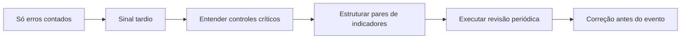
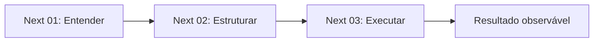

# Indicadores de risco cognitivo: como detectar, medir e acompanhar?

## 1. Contexto
O painel do carro avisa que a gasolina está acabando antes de o motor parar. Se o único sinal fosse o carro parado na estrada, você saberia do problema tarde demais. Muitas equipes acompanham risco cognitivo assim: contam erros e retrabalho depois que aconteceram. Indicadores servem para enxergar antes — e para saber se os controles escolhidos estão, de fato, funcionando.

## 2. 5W2H

| Variável | Síntese |
|---|---|
| O que? | Sinais que mostram exposição, saúde dos controles e eventos. |
| Por quê? | Contar erros mostra o problema tarde demais. |
| Onde? | Em cada controle associado a uma tarefa crítica. |
| Quando? | De forma contínua, com revisão periódica. |
| Quem? | Donos dos processos e quem decide prioridades. |
| Como? | Combinando indicadores antecedentes e de resultado. |
| Quanto? | Poucos indicadores por controle crítico bastam. |

## 3. Referência padrão-ouro
O Health and Safety Executive (HSE) é referência em indicadores de segurança de processos. O guia HSG254, *Developing process safety indicators* (2006), propõe um sistema duplo para cada controle de risco: indicadores antecedentes (*leading*), que verificam se ações-chave acontecem como previsto, e indicadores de resultado (*lagging*), que registram falhas e incidentes. Essa dupla garantia passou a orientar o monitoramento de controles.

## 4. Problema existente
**Definição.** Medir só o que já deu errado.
**Identificação.** Relatórios que listam erros, sem sinal antecedente.
**Explicação.** Eventos são fáceis de contar; condições exigem desenho de medida.
**Fechamento.** A equipe descobre a falha de um controle pelo incidente.

## 5. Problema solucionado
**Definição.** Já existe método para pares de indicadores por controle.
**Identificação.** O HSG254 propõe medir entradas e saídas de cada sistema de controle de risco.
**Explicação.** O antecedente diz se o controle é usado; o de resultado, se ele protege.
**Fechamento.** Fica possível corrigir antes do evento.

## 6. Processo
1. **Entender:** listar os controles críticos e o que cada um deve evitar.
2. **Estruturar:** definir um indicador antecedente e um de resultado por controle.
3. **Executar:** coletar, revisar periodicamente e ajustar o controle.

## 7. Visão do sistema

## 8. Progresso esperado
Antes, a equipe só via o checklist falhar quando um erro chegava ao cliente. Com a taxa de uso do checklist como indicador antecedente e as correções pós-envio como resultado, ela percebe o abandono do controle semanas antes.

## 9. Aviso
Indicador não é meta individual. Usar o indicador para avaliar pessoas incentiva a subnotificação e distorce o sinal.

## 10. Next 01-02-03
**Next 01 — Entender:** escolha um controle crítico.
**Next 02 — Estruturar:** defina um indicador antecedente e um de resultado.
**Next 03 — Executar:** revise os dois mensalmente com quem executa a tarefa.

## 11. Fontes e aprofundamento
- Developing process safety indicators: A step-by-step guide for chemical and major hazard industries (HSG254) — Health and Safety Executive, 2006 — https://www.hse.gov.uk/pubns/books/hsg254.htm
- Development of NASA-TLX (Task Load Index) — S. G. Hart e L. E. Staveland, 1988 — https://doi.org/10.1016/S0166-4115(08)62386-9

O NASA-TLX é uma opção para medir carga percebida como indicador antecedente de exposição.

## 12. Infográfico 16:9
**Problema:** o sinal chega tarde — carro parado na estrada.
**Processo:** pares de indicadores — antecedente e de resultado — ligados a cada controle.
**Progresso:** correção antes do evento — painel com alerta acendendo cedo.
