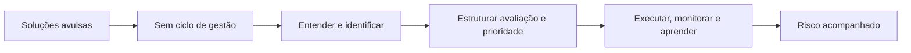

# Gestão do risco cognitivo: como identificar, avaliar, tratar e acompanhar?

## 1. Contexto
Uma equipe percebe que relatórios voltam com erros toda sexta-feira. Alguém sugere um novo software; outra pessoa, um treinamento; outra, mais uma revisão. Cada solução é razoável, mas nenhuma parte de uma pergunta comum: qual risco estamos tratando e como saberemos se melhorou? Gestão do risco cognitivo é a prática de responder a essa pergunta de forma contínua, com o mesmo rigor usado para outros riscos da organização.

## 2. 5W2H

| Variável | Síntese |
|---|---|
| O que? | Prática contínua de identificar, avaliar, tratar e acompanhar riscos. |
| Por quê? | Soluções isoladas não mostram se o risco diminuiu. |
| Onde? | Em processos, equipes e projetos com tarefas críticas. |
| Quando? | Em ciclos regulares e após eventos relevantes. |
| Quem? | Liderança, donos de processo e equipes executoras. |
| Como? | Aplicando o processo da ISO 31000 à cognição. |
| Quanto? | Um ciclo trimestral por processo crítico é ponto de partida. |

## 3. Referência padrão-ouro
A Organização Internacional de Normalização (ISO) é a referência em gestão de risco pela norma ISO 31000:2018. Ela organiza a gestão em princípios, estrutura e processo; o processo inclui estabelecer o contexto, identificar, analisar e avaliar riscos, tratar, monitorar e analisar criticamente. Entre os princípios, a norma pede considerar fatores humanos e culturais, o que abre espaço explícito para a cognição.

## 4. Problema existente
**Definição.** Tratar riscos cognitivos com soluções avulsas.
**Identificação.** Ferramentas e treinamentos adotados sem diagnóstico nem medida.
**Explicação.** Falta um ciclo que conecte análise, decisão e acompanhamento.
**Fechamento.** A organização não sabe o que funcionou.

## 5. Problema solucionado
**Definição.** O processo genérico de gestão de risco já está padronizado.
**Identificação.** A ISO 31000:2018 define o ciclo e o integra à governança.
**Explicação.** O mesmo ciclo pode receber fatores, exposição, eventos, controles e indicadores cognitivos.
**Fechamento.** O risco cognitivo entra no mesmo idioma dos demais riscos.

## 6. Processo
1. **Entender:** estabelecer contexto e identificar riscos cognitivos nas tarefas críticas.
2. **Estruturar:** analisar, avaliar e priorizar pela exposição e criticidade.
3. **Executar:** tratar com controles, monitorar indicadores e aprender com eventos.

## 7. Visão do sistema

## 8. Progresso esperado
Antes, cada sexta-feira trazia uma nova solução. Com um ciclo trimestral — identificar, priorizar, tratar e medir —, a equipe escolhe um controle por vez e sabe, pelos indicadores, se os erros de sexta diminuíram.

## 9. Aviso
A ISO 31000 é diretriz genérica e não trata especificamente de cognição. A aplicação ao risco cognitivo é proposta deste framework.

## 10. Next 01-02-03
**Next 01 — Entender:** escolha um processo crítico e descreva seu contexto.
**Next 02 — Estruturar:** liste e priorize três riscos cognitivos.
**Next 03 — Executar:** trate o primeiro e marque a próxima revisão.

## 11. Fontes e aprofundamento
- ISO 31000:2018 Risk management — Guidelines — ISO, 2018 — https://www.iso.org/standard/65694.html
- Reducing error and influencing behaviour (HSG48) — Health and Safety Executive, 1999 — https://www.hse.gov.uk/pubns/books/hsg48.htm

## 12. Infográfico 16:9
**Problema:** soluções avulsas — várias ferramentas soltas sobre a mesa.
**Processo:** ciclo identificar, avaliar, tratar e monitorar em volta da tarefa crítica.
**Progresso:** risco acompanhado — calendário com revisões marcadas.
