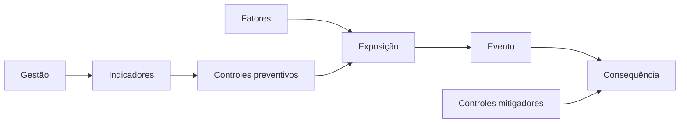

# Framework de risco cognitivo: como os elementos se conectam?

## 1. Contexto
Em casa, você sabe que o fogão aceso (fator) e a distração do telefone (exposição) podem levar à panela queimada (evento) e, no pior caso, a um incêndio (consequência). O timer e o detector de fumaça (controles) atuam em pontos diferentes dessa cadeia. Quando cada peça é analisada separadamente, perde-se a lógica que as liga. O framework do Risco Cognitivo serve para ver a cadeia inteira de uma vez.

## 2. 5W2H

| Variável | Síntese |
|---|---|
| O que? | Modelo que conecta fatores, exposição, eventos, consequências e controles. |
| Por quê? | Peças analisadas isoladamente escondem a lógica do risco. |
| Onde? | Em qualquer tarefa crítica que dependa de cognição. |
| Quando? | Ao desenhar processos e ao investigar eventos. |
| Quem? | Gestores, analistas de risco e equipes. |
| Como? | Organizando a cadeia em um diagrama com barreiras. |
| Quanto? | Um diagrama por tarefa crítica, revisado periodicamente. |

## 3. Referência padrão-ouro
O Center for Chemical Process Safety (CCPS) e o Energy Institute são referência na análise *bow tie*. No livro *Bow Ties in Risk Management* (2018), padronizam o diagrama que liga ameaças a um evento central e às consequências, com barreiras preventivas antes do evento e mitigadoras depois. A publicação buscou uniformizar terminologia e uso do método na indústria de processos.

## 4. Problema existente
**Definição.** Analisar fatores, eventos e controles como listas separadas.
**Identificação.** Planilhas de riscos sem relação explícita entre causa, evento e barreira.
**Explicação.** Sem modelo, não se vê qual controle protege qual etapa.
**Fechamento.** Lacunas de proteção passam despercebidas.

## 5. Problema solucionado
**Definição.** A análise bow tie já conecta causas, evento e consequências.
**Identificação.** CCPS e Energy Institute (2018) consolidaram o método e seu vínculo com a gestão de segurança de processos.
**Explicação.** Barreiras ficam associadas a ameaças e consequências específicas.
**Fechamento.** As lacunas de proteção ficam visíveis.

## 6. Processo
1. **Entender:** definir o evento central e as consequências possíveis.
2. **Estruturar:** ligar fatores e exposição ao evento e posicionar controles e indicadores.
3. **Executar:** fechar lacunas e revisar o diagrama no ciclo de gestão.

## 7. Visão do sistema

## 8. Progresso esperado
Antes, a lista de riscos da equipe não mostrava qual controle protegia o envio de relatórios. Com o diagrama da tarefa, ela vê que só havia barreira depois do erro, cria um controle preventivo e acompanha seu uso.

## 9. Aviso
O bow tie vem da segurança de processos; sua adaptação à cognição é proposta deste framework e não substitui análise especializada em contextos de alto risco.

## 10. Next 01-02-03
**Next 01 — Entender:** escolha um evento que você quer evitar.
**Next 02 — Estruturar:** desenhe fatores à esquerda, consequências à direita e controles no meio.
**Next 03 — Executar:** crie o controle que falta e defina seu indicador.

## 11. Fontes e aprofundamento
- Bow Ties in Risk Management: A Concept Book for Process Safety — CCPS e Energy Institute, 2018 — https://www.aiche.org/ccps/resources/publications/books/bow-ties-risk-management-concept-book-process-safety
- ISO 31000:2018 Risk management — Guidelines — ISO, 2018 — https://www.iso.org/standard/65694.html
- Human error: models and management — James Reason, BMJ, 2000 — https://doi.org/10.1136/bmj.320.7237.768

## 12. Infográfico 16:9
**Problema:** peças soltas — cartões de fator, evento e controle espalhados.
**Processo:** gravata-borboleta — fatores à esquerda, evento no centro, consequências à direita.
**Progresso:** lacunas visíveis — um espaço vazio preenchido por um novo controle.
