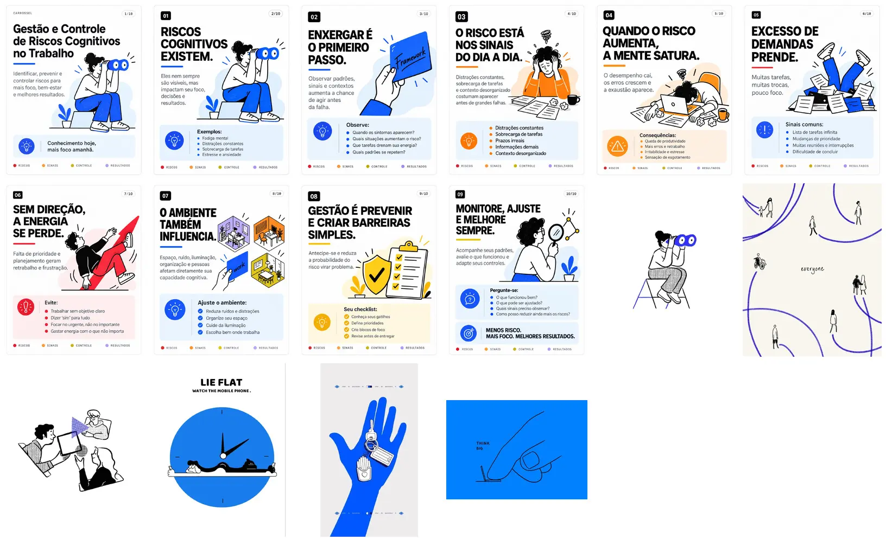

# Banco de imagens — Risco Cognitivo

Fonte: `Banco_imagens_.zip` enviado pelo usuário em 2026-10-02 (16 arquivos). Cópias otimizadas em webp
(lado maior ≤ 1400 px); `manifest.json` descreve cada peça (título, se tem texto, transcrição, uso).

**Regra (ADR-12):** nas páginas do site só entram imagens **sem texto** (`tem_texto: false`). Peças com texto
— o carrossel "Gestão e Controle de Riscos Cognitivos no Trabalho" e as ilustrações com palavras na arte
(*everyone*, *Think big*, *Lie flat*) — ficam aqui para redes, newsletter e materiais fora do site.
Este diretório não é servido pelo site.

| Peça | Texto | No site |
|---|---|---|
| `ilustracao-binoculo` | não | `public/images/binoculo.webp` — hero da home e de `/about/`, imagem OG |
| `ilustracao-equipe-tablet` | não | `public/images/equipe-tablet.webp` — `/about/`, "Como produzimos" |
| `ilustracao-mao-chaves` | não | `public/images/mao-chaves.webp` — `/login/`, `/signup/` |
| `ilustracao-caminhos-everyone` | "everyone" | — |
| `ilustracao-think-big` | "THINK BIG" | — |
| `ilustracao-lie-flat` | "LIE FLAT…" | — |
| `carrossel-00-capa` … `carrossel-09-*` | sim (transcrição no manifest) | — |

Para usar uma peça nova no site: confirmar `tem_texto: false`, otimizar para `public/images/<slug>.webp`
(`convert -resize '1200x1200>' -quality 82`), escrever `alt` descritivo e registrar o uso no manifest.
