# RC-DESIGN-MOCKUPS-001 — Identidade visual dos mockups em todas as rotas

VERSION: 1.0.0 · DATA: 2026-10-02 · ESCOPO: `apps/blog` (todas as rotas) · DECISÃO: ADR-11 (`CLAUDE.md` do app)

Entrega em dois PRs. **PR A** (hubexecutar-lgtm/react-router-starter-template#6) portou o redesign editorial
e as rotas dos mood boards (ADR-09/ADR-10). **PR B** (este registro) aplica os **valores exatos** dos mockups
— fundo, paleta, tipografia, bordas, raio e sombras — na camada de tokens, de onde chegam a todas as rotas.

Método (o mesmo do plugin Design / design-handoff, executado à mão): spec → tokens → primitives →
componentes → rotas → verificação. Mood boards de referência: `../HANDOFF-RC-GLOBAL-DESIGN-CONTENT-001/referencias/`.

## 1. Decisões do usuário

1. Portar a branch e aplicar os tokens, em 2 PRs.
2. **Valores exatos do mockup prevalecem** — inverte C-02/C-03 de `HANDOFF-RC-GLOBAL-DESIGN-CONTENT-001/03-reconciliacao.md`.
   Ajuste só onde o contraste AA falha (seção 4).
3. Tema escuro mantido como **PROVISIONAL** (os mockups só definem o claro).

## 2. Spec (mood board 10, "Gramática visual")

| Camada | Mockup | Token | Uso |
|---|---|---|---|
| Canvas | `#FFFFFF` | `--background`, `--surface-page` | página, leitura |
| Subtle | `#F5F5F4` | `--surface-subtle`, `--surface-default` (= `--card`, `--plain-surface`, `--table-surface`) | blocos, seções, cards de apoio, células |
| Tabular | `#EAEAE8` | `--surface-tabular` (= `--table-head-surface`, `--surface-selected`), `--border-default` | cabeçalho de tabela, seleção, borda estrutural |
| Diagram | `#EFF6FF` | `--surface-model` (= `--primary-soft`, `--plain-accent-soft`) | painéis de modelo, princípios, fluxos |
| Texto | `#202124` | `--foreground` | títulos e corpo |
| Texto secundário | `#6B7280` | `--muted-foreground` | metadados, lead, eyebrow (no canvas) |
| Ação | `#2563EB` | `--primary`, `--ring` (hover `#1D4ED8`) | botões, links, foco, item ativo |
| Display | Inter Bold 56/64 | `rc-display` (700, −0,03em), `--display-weight: 700` | h1, títulos |
| Corpo | Inter Regular 18/28 | `body`, `rc-lead` (line-height 1,556) | texto |
| Mono | IBM Plex Mono 14/20 | `--font-mono`, `rc-eyebrow`, `rc-meta` | IDs, datas, rótulos |
| Raio | botões 8, cards 12–16, chips pílula | `rounded-lg` (8) nos botões, `--surface-radius-card` (12), `rounded-full` | |
| Sombra | nenhuma em cards | `--elevation-flat` (ADR-09) | só overlays têm sombra |

Derivados (não estão no mockup): `--surface-hover` `#F0F0EE` (mantém `--primary` ≥ 4,5:1), `--border-subtle`
`#F0F0EE`, `--border-strong` `#D6D6D3`, `--input` `#D1D5DB` (contorno de campo mais forte que a borda estrutural).

Inalterados: callouts (ADR-03), gráficos (ADR-04), marcadores `--area-*` da Loja (ADR-08), `--plain-font`
(diagramas box-drawing em `ui-monospace`, ADR-05).

## 3. Mapa slide → rota → componente → token

| Slide | Rota | Componentes | Tokens decisivos |
|---|---|---|---|
| 01–02 | `/` | `home.tsx`, `ArticleCard`, `TerritoryCard`, `PlainTextPanel` | Canvas, Subtle (Missão), Inter 700, Primary |
| 03 | `/blog/:slug/` | `blog.$slug.tsx`, `ArticleMeta`, `EvidenceTable` | Subtle (Pergunta do território), Tabular (th), Plex Mono (meta) |
| 04 | `/blog/` | `FilterChips`, `ArticleCard` (row) | chips pílula hover/ativo Primary |
| 05 | `/mapas/` | `AsciiDiagram`, `SURFACE_LINK` | Subtle, Primary (setas) |
| 06 | `/evidencias/` | `EvidenceTable`, `PlainTextPanel` | Tabular/Subtle (gutters), texto on-gray |
| 07 | `/guias/`, `/signup/` | `SURFACE`, `NewsletterNotice`, `Button` | Subtle, Primary sólido |
| 08 | `/buscar/` | `buscar.tsx` (abas, sugestões) | Primary (aba ativa), chips Subtle |
| 09 | `/temas/`, mobile | `SiteHeader` (menu), `TerritoryCard` | Canvas, Subtle |
| 10 | todas | `global.css`, `Button`, `Card`, `.ds-table`, showroom `#gramatica` | todos |

## 4. Desvios de acessibilidade (WCAG 2.1 AA)

Contraste medido:

| Texto \ fundo | Canvas | Subtle | Hover | Tabular | Diagram |
|---|---|---|---|---|---|
| `#202124` | 16,10 | 14,76 | 14,11 | 13,36 | 14,79 |
| `#6B7280` (mockup) | **4,83** | 4,43 ✗ | 4,24 ✗ | 4,01 ✗ | 4,44 ✗ |
| `#5F6670` (on-gray) | 5,80 | **5,32** | **5,08** | **4,81** | **5,33** |
| `#2563EB` | **5,17** | **4,74** | **4,53** | 4,29 ✗ | **4,75** |

- **Texto secundário sobre cinza.** `#6B7280` só passa no canvas. Dentro de qualquer superfície cinza
  (`[data-slot=card]`, `.ds-table`, `.plain-surface`, `.rc-surface`, `bg-card/muted/secondary/accent`,
  `bg-[var(--surface-*)]`), `global.css` troca `--muted-foreground` por `--muted-foreground-on-gray` `#5F6670`.
  O markup continua usando `text-muted-foreground`; callouts usam o tom on-gray direto.
- **Azul sobre Tabular.** 4,29:1: não se usa texto azul em `#EAEAE8` (cabeçalhos de tabela usam `--foreground`).
- **Hover.** `#F0F0EE` em vez de um cinza mais escuro, para que links azuis continuem ≥ 4,5:1 no hover.
- **Contorno de campo.** `#D1D5DB` (1,47:1) segue abaixo de 3:1 (WCAG 1.4.11), como o anterior (`#D2D2D7`);
  o estado de foco (anel `--ring`, 3px) é o indicador acessível. Registrado como pendência.

## 5. Verificação

- `tests/tokens.spec.ts` (novo): valores computados da paleta; h1 em Inter 700, eyebrow em IBM Plex Mono;
  texto secundário ≥ 4,5:1 dentro de superfícies cinza em `/`, `/loja/`, `/temas/`, `/evidencias/`; botões com raio 8
  e outline primário; Gramática visual igual ao slide 10.
- `tests/surfaces.spec.ts` / `plain.spec.ts`: contrato de superfícies com os valores novos e AA claro/escuro.
- Baselines de screenshot regeneradas de propósito (design-system, plain, surfaces) após revisão visual.
  Os testes rodam sem acesso ao Google Fonts, então as baselines usam a fonte de fallback; as capturas
  abaixo foram feitas com as fontes reais.

## 6. Antes / depois

Capturas da build de produção (`vite preview`, workerd) antes e depois do PR B.

| Rota | Slide | Antes (1440) | Depois (1440) | 390 |
|---|---|---|---|---|
| `/` | 01–02 | 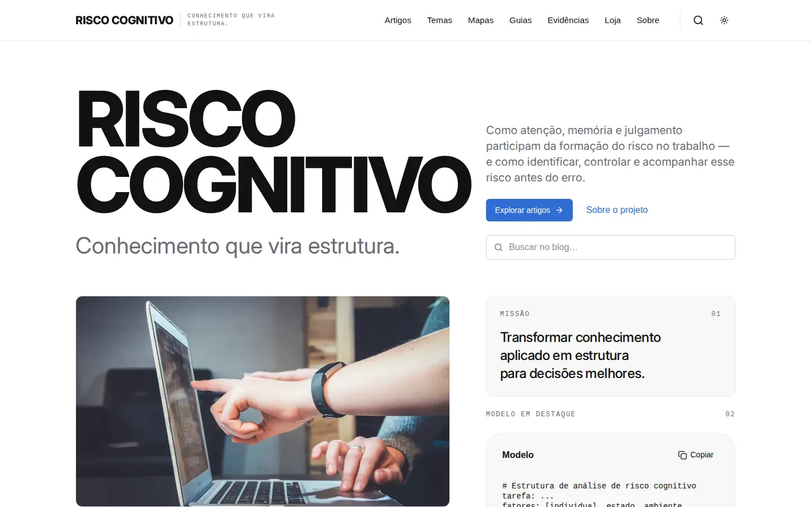 | 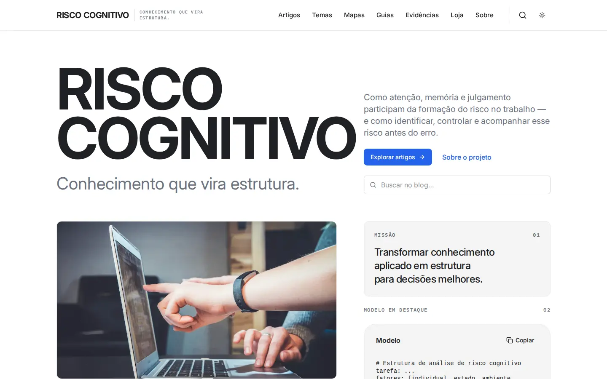 | [390 antes](screenshots/home-390-antes.webp) · [390 depois](screenshots/home-390-depois.webp) |
| `/blog/` | 04 | 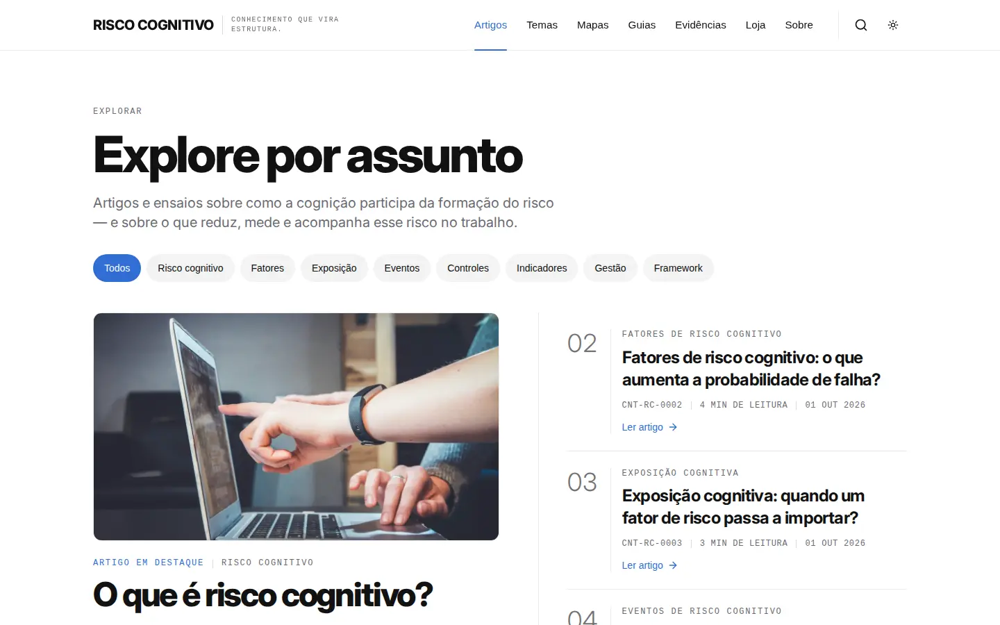 |  | [390 antes](screenshots/blog-390-antes.webp) · [390 depois](screenshots/blog-390-depois.webp) |
| `/blog/o-que-e-risco-cognitivo/` | 03 |  |  | [390 antes](screenshots/artigo-390-antes.webp) · [390 depois](screenshots/artigo-390-depois.webp) |
| `/temas/` | 09 | 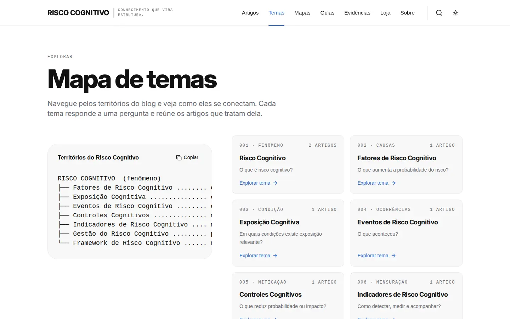 | 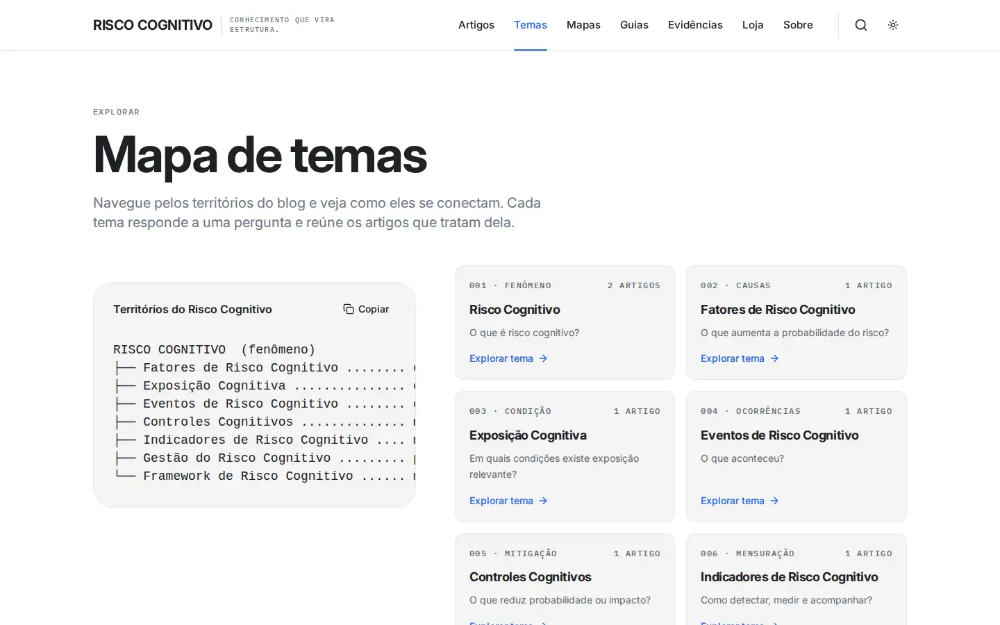 | [390 antes](screenshots/temas-390-antes.webp) · [390 depois](screenshots/temas-390-depois.webp) |
| `/mapas/` | 05 | 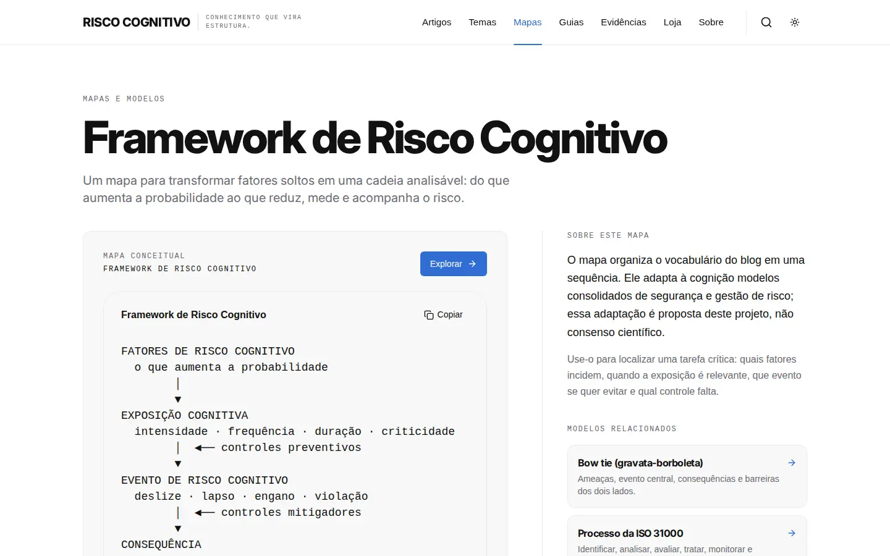 | 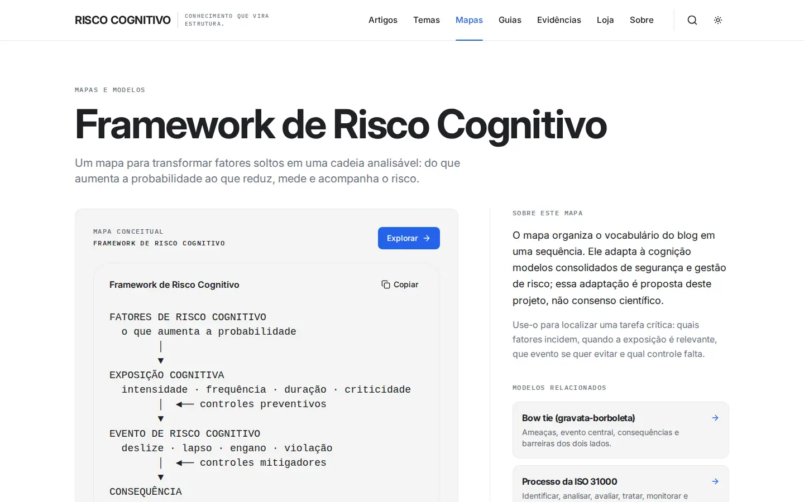 | [390 antes](screenshots/mapas-390-antes.webp) · [390 depois](screenshots/mapas-390-depois.webp) |
| `/guias/` | 07 | 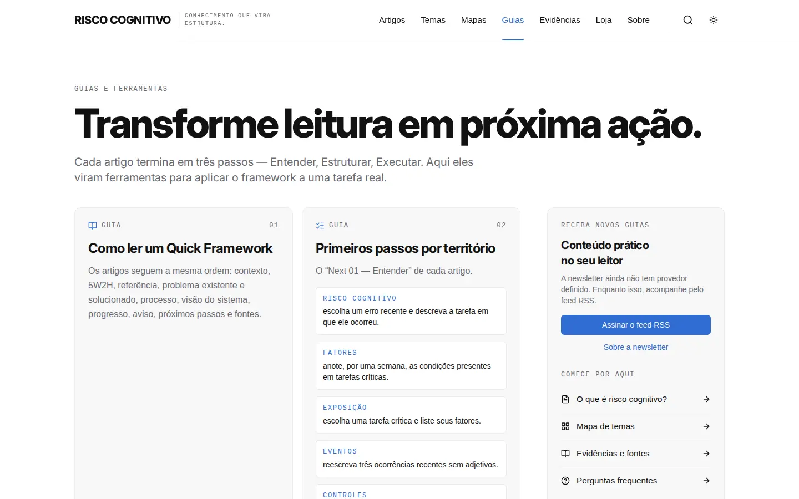 |  | [390 antes](screenshots/guias-390-antes.webp) · [390 depois](screenshots/guias-390-depois.webp) |
| `/evidencias/` | 06 | 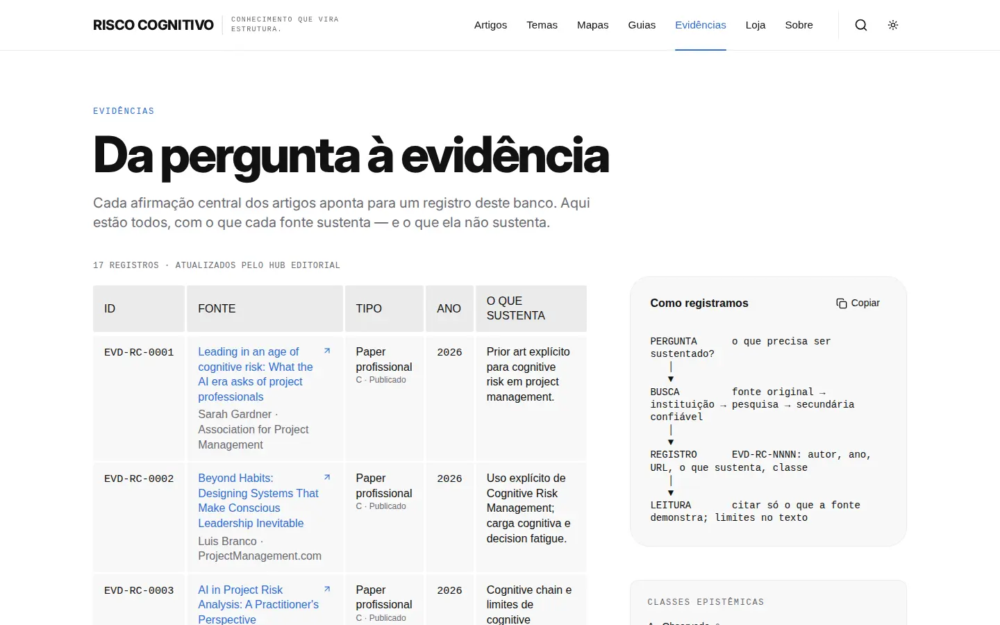 |  | [390 antes](screenshots/evidencias-390-antes.webp) · [390 depois](screenshots/evidencias-390-depois.webp) |
| `/buscar/?q=risco` | 08 | 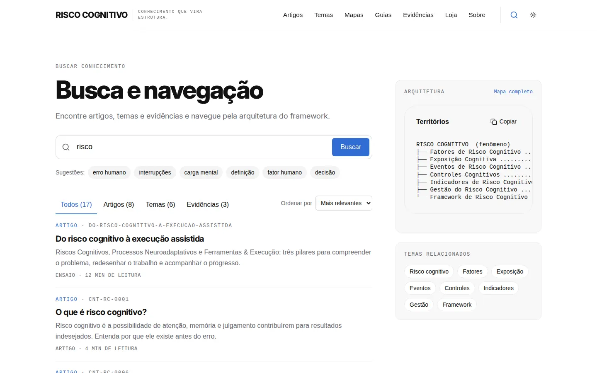 |  | [390 antes](screenshots/buscar-390-antes.webp) · [390 depois](screenshots/buscar-390-depois.webp) |
| `/loja/` | — (ADR-08) | 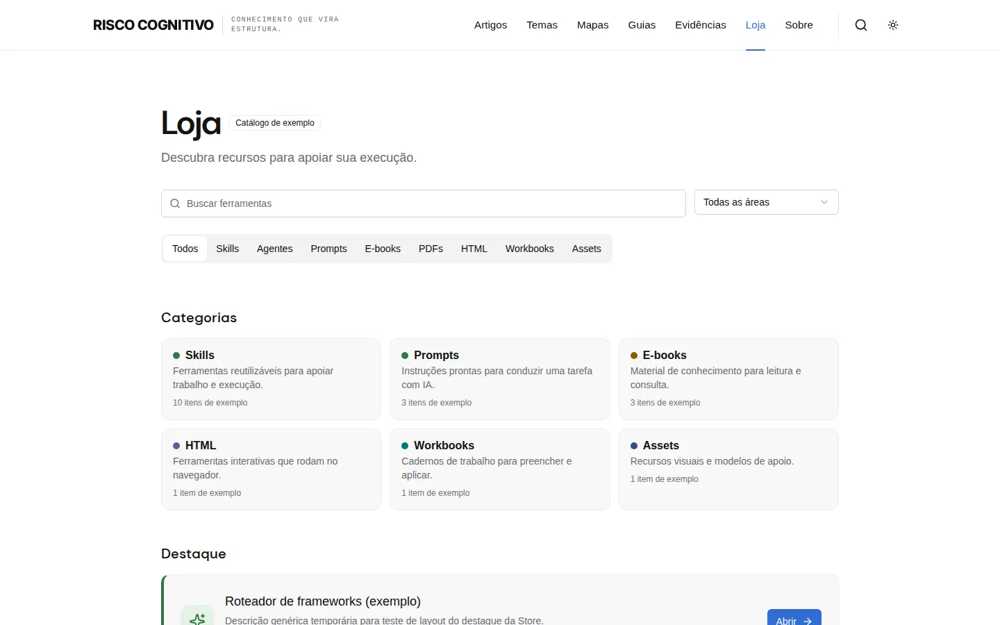 | 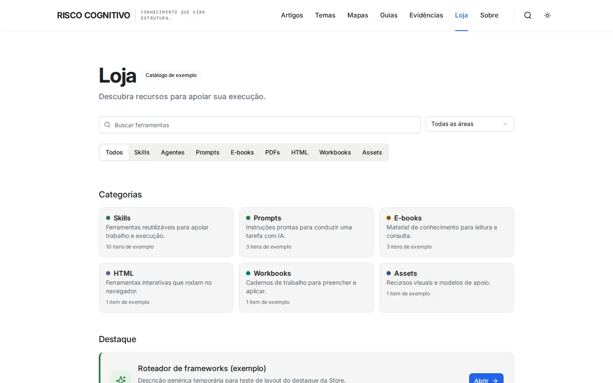 | [390 antes](screenshots/loja-390-antes.webp) · [390 depois](screenshots/loja-390-depois.webp) |
| `/admin/design-system/` | 10 | 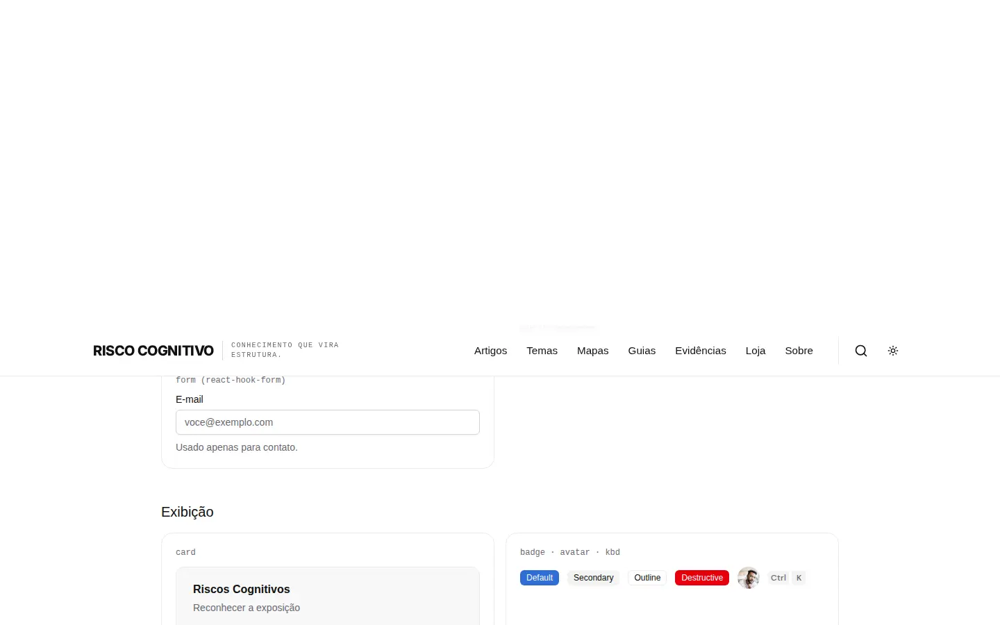 |  | [390 antes](screenshots/design-system-390-antes.webp) · [390 depois](screenshots/design-system-390-depois.webp) |

## 7. Pendências

- Tema escuro: PROVISIONAL até existir especificação.
- Contorno de campos abaixo de 3:1 (seção 4).
- Elementos dos mockups sem dado no banco editorial (fotos de destaque, autores, contagens) seguem fora do site (ADR-10).
