# RC-UX-HIG-002 — Gate HIG transversal, anatomia de texto, cards-célula, halftone e banco de imagens

VERSION: 1.0.0 · DATA: 2026-10-02 · ESCOPO: `apps/blog` (todas as rotas) + regra do monorepo (ADR-M03)

Entrega em dois PRs (ADR-M02):

- **PR C** (hubexecutar-lgtm/react-router-starter-template#8):
  - cards = célula da tabela;
  - plain text estruturado;
  - tokens de texto e ritmo;
  - halftone orgânico;
  - banco de imagens.
- **PR D** (este):
  - anatomia Apple Developer Programs em todas as rotas;
  - regra UX-GOV-HIG-001 (`docs/governance/UX-GOV-HIG-001.md`, ADR-M03);
  - gate automatizado `tests/hig.spec.ts`;
  - auditoria `docs/audit/HIG-WEB-AUDIT.{json,md}`.

## O que mudou, por pedido do usuário

| Pedido | Implementação |
|---|---|
| Fundo de bolinhas orgânico onde possível | `DotField` (SVG determinístico, `--dot-color` = `--primary`, `aria-hidden`); arte dos heroes (`HeroArt`/`PageHero`) e faixa acima do rodapé; o gate garante que nunca fica sob texto |
| Cards e bordas iguais à tabela | `rc-cell`: fundo `--table-surface`, sem contorno, raio 2px, separação por gutter; cabeçalho de painel = faixa Tabular |
| Tokens e regras transversais; nada desestruturado | escala `--text-*`, `--measure` (68ch) aplicada a todo `p/li/dd` de `main`; plain text vira `dl`/listas/tabela; tabelas empilham em células rotuladas no celular; prosa mono proibida |
| Imagens do banco; binóculo na página institucional | `docs/banco-imagens/` (16 peças, transcrição no manifest); no site só as sem texto: binóculo (home e Sobre), equipe (Sobre), mão com chaves (login, cadastro) |
| Fonte de verdade: developer.apple.com/programs | `PageHero` (eyebrow, h1, lead curto, ações, arte), `Section` (h2 + lead + "Saiba mais ›"), `FeatureBlock`/`FeatureRow`, `CompareCards`, `ChevronLink`; links de texto com chevron, botões com seta |
| Regra para o site atual e futuro | ADR-M03 no `CLAUDE.md` da raiz + gate no `npm test` + checklist no template de PR |

## Gate e auditoria

`tests/hig.spec.ts` cobre 47 rotas a 1440, 390 e 320px:

- axe WCAG 2.0/2.1/2.2 A+AA;
- um `h1` e títulos sem salto;
- landmarks, skip link e `lang`;
- alvos de toque ≥ 24px (WCAG 2.5.8, com as exceções da norma);
- reflow em 320px;
- linhas de no máximo 75 caracteres;
- nenhuma prosa em mono;
- `alt` em todas as imagens;
- halftone fora do texto;
- tabelas sem corte no celular;
- foco visível;
- amostra do tema escuro.

Resultado (`docs/audit/HIG-WEB-AUDIT.md`):

- **Linha de base** (`main` @ `ab685e2`): 9 falhas — 1 P0 (estouro em 320px em `/about/`) e 8 P1 (medida, títulos, axe).
- **Reteste:** 0 falhas; release **PASS**.
- **Checklist manual:** 4 itens PARTIAL (P2/P3), sem P0/P1:
  - `/admin/*` sem guarda no app (o host está atrás do Cloudflare Access);
  - controlador de dados a definir em `/privacy/`;
  - tema escuro provisório;
  - Safari real pendente.

Navegadores: o container só tem Chromium, então o iPhone foi emulado por viewport. A verificação no Safari (iOS e macOS) fica como VERIFICATION manual do usuário.

## Casos do iPhone (depois)

| Workflow editorial (`/about/`) | Briefing do infográfico (artigo) | Fontes citadas (artigo) |
|---|---|---|
| 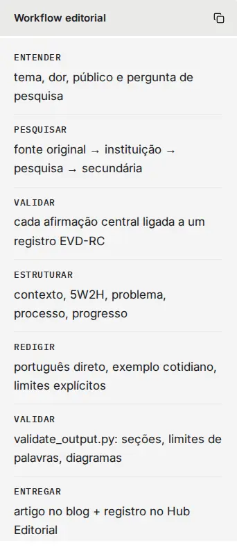 | 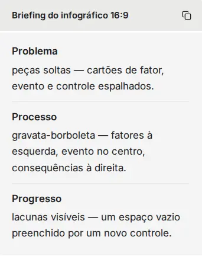 | 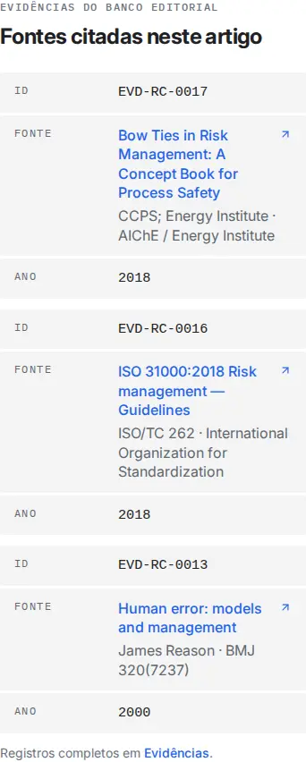 |

## Antes / depois

- **Antes:** estado após RC-DESIGN-MOCKUPS-001.
- **Depois:** este PR.

| Rota | Antes (1440) | Depois (1440) | 390 |
|---|---|---|---|
| `/` |  | 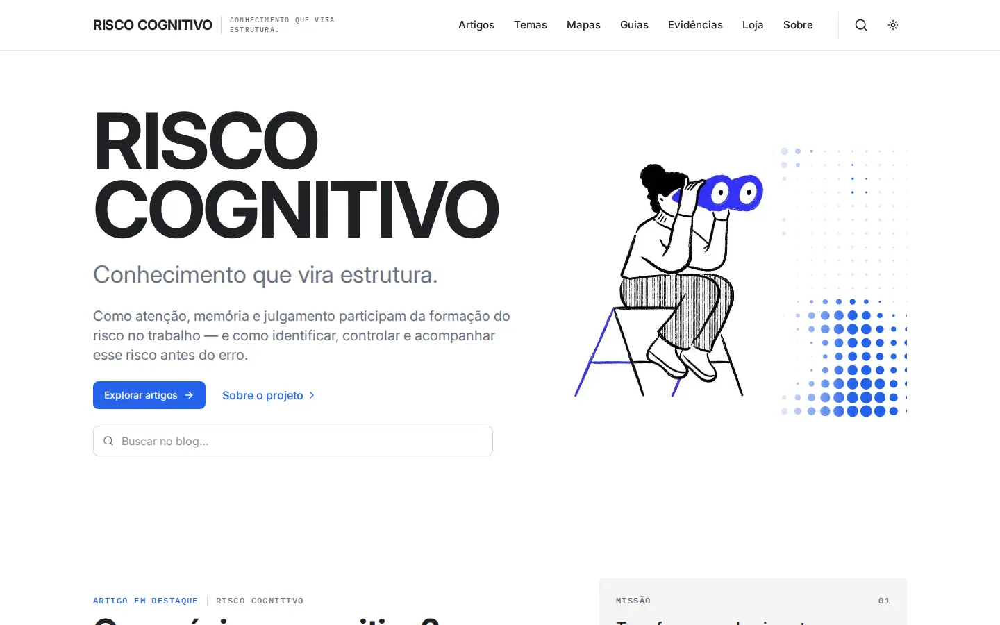 | [antes](screenshots/home-390-antes.webp) · [depois](screenshots/home-390-depois.webp) |
| `/blog/` | 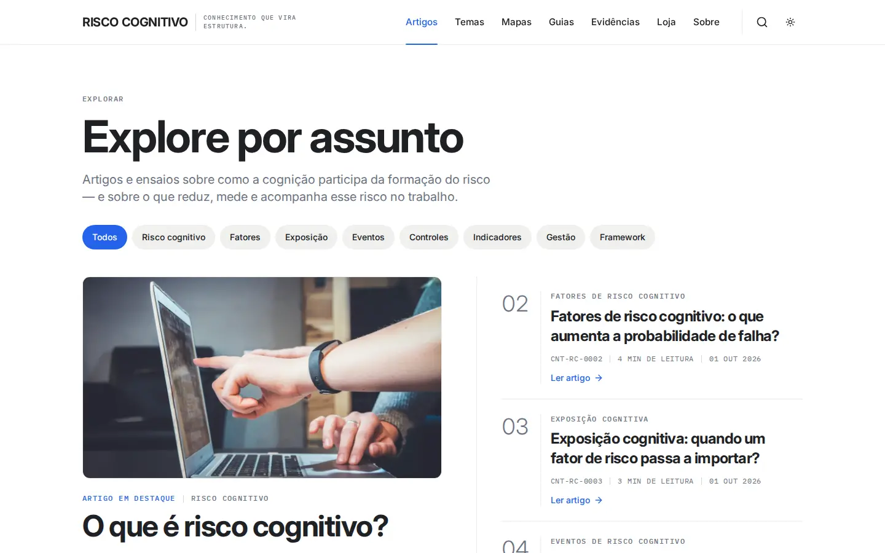 | 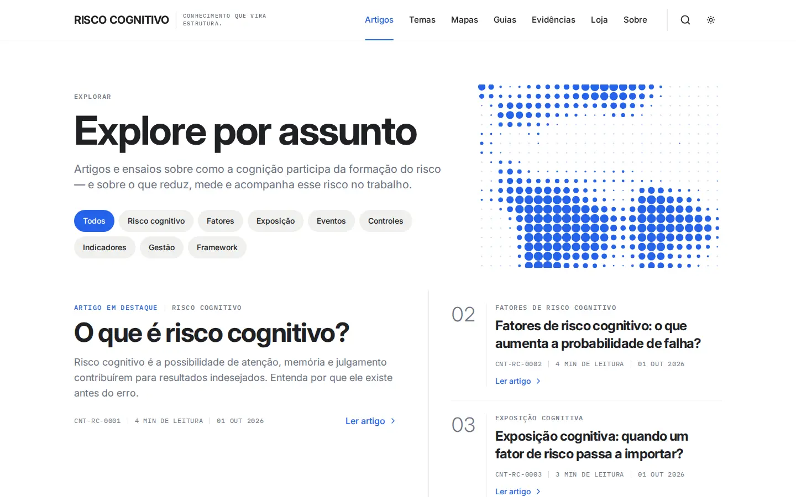 | [antes](screenshots/blog-390-antes.webp) · [depois](screenshots/blog-390-depois.webp) |
| `/blog/o-que-e-risco-cognitivo/` |  | 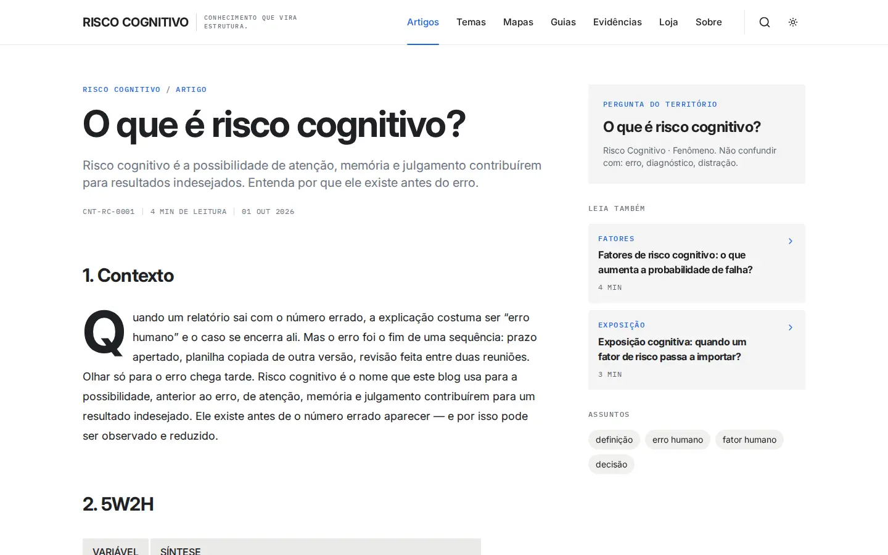 | [antes](screenshots/artigo-390-antes.webp) · [depois](screenshots/artigo-390-depois.webp) |
| `/temas/` |  | 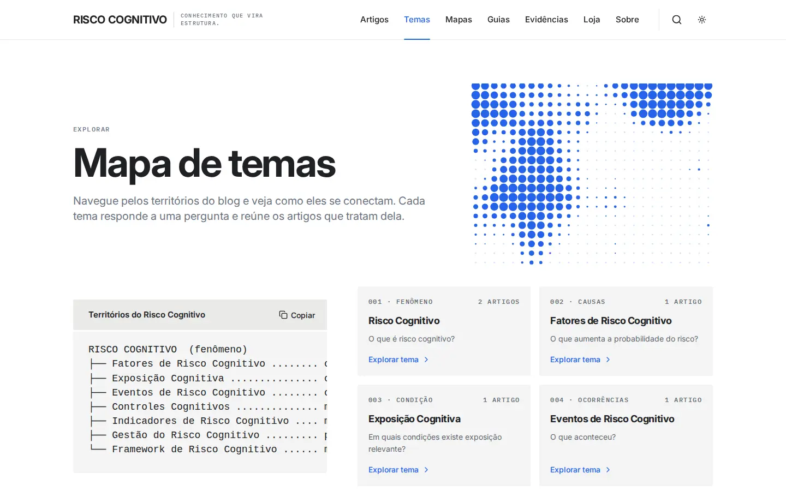 | [antes](screenshots/temas-390-antes.webp) · [depois](screenshots/temas-390-depois.webp) |
| `/mapas/` |  | 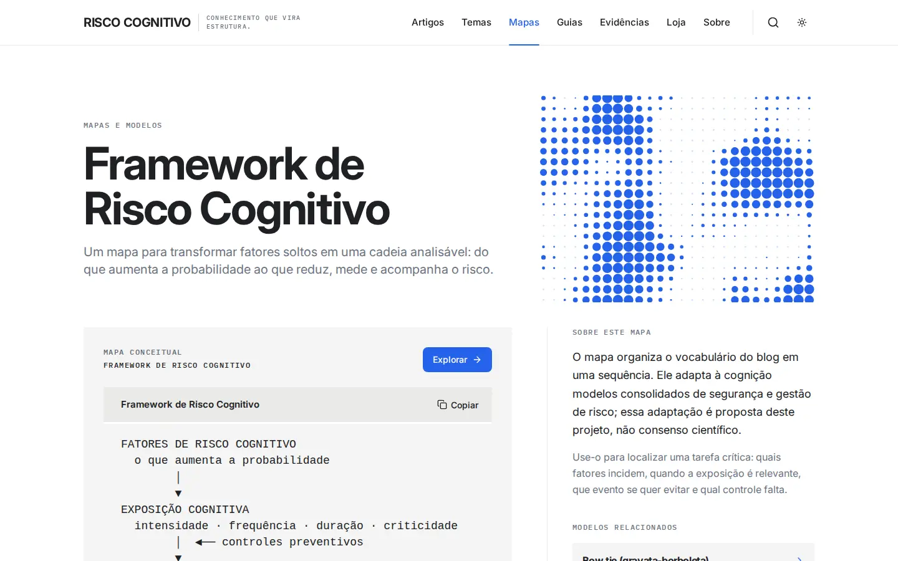 | [antes](screenshots/mapas-390-antes.webp) · [depois](screenshots/mapas-390-depois.webp) |
| `/guias/` | 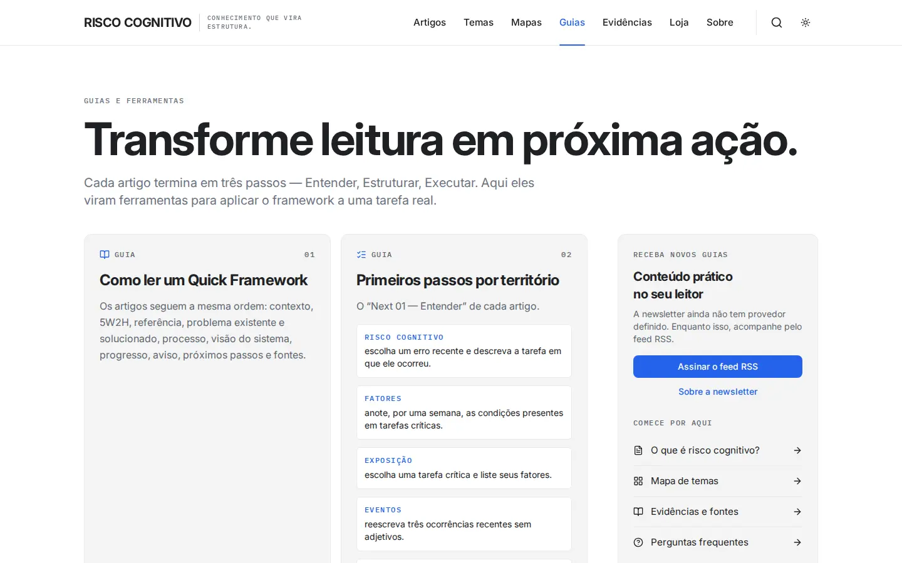 | 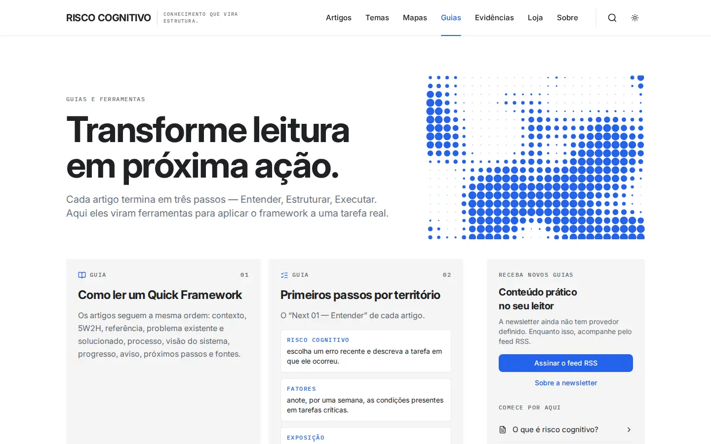 | [antes](screenshots/guias-390-antes.webp) · [depois](screenshots/guias-390-depois.webp) |
| `/evidencias/` | 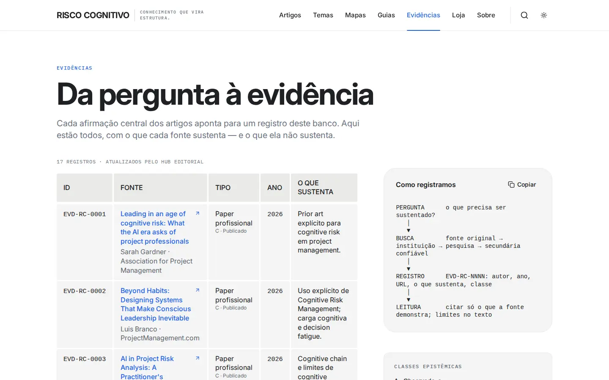 | 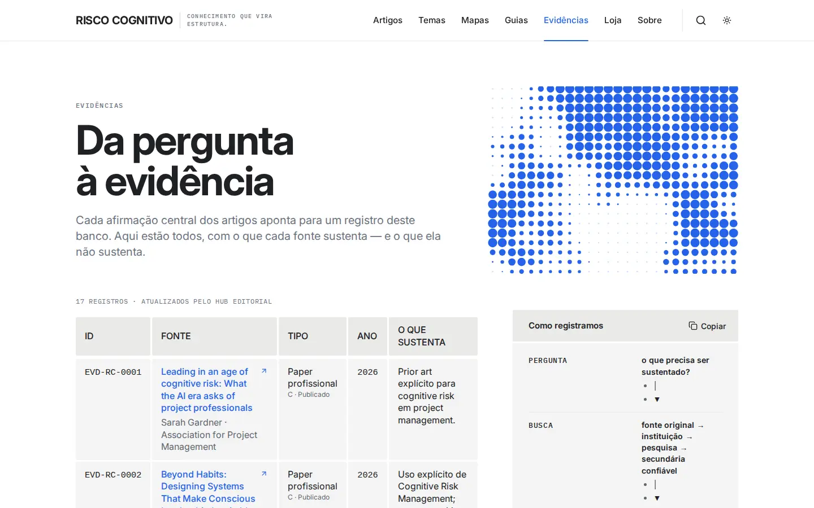 | [antes](screenshots/evidencias-390-antes.webp) · [depois](screenshots/evidencias-390-depois.webp) |
| `/buscar/?q=risco` | 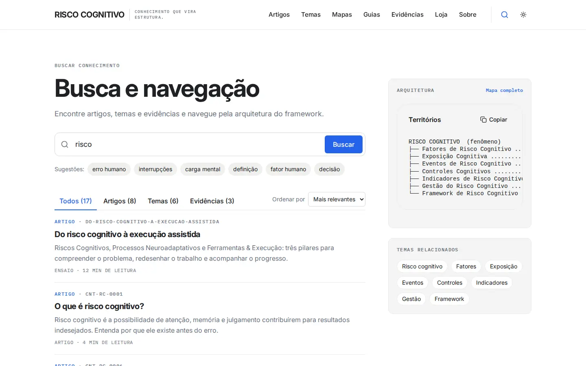 | 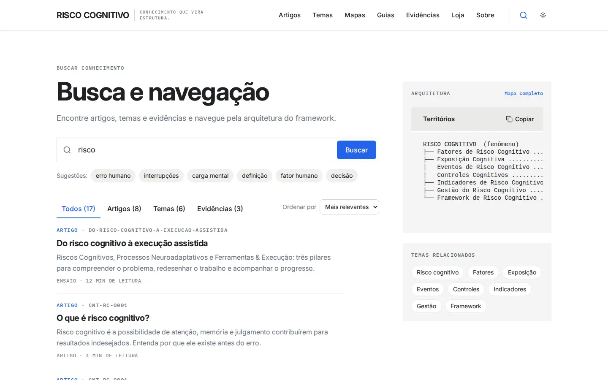 | [antes](screenshots/buscar-390-antes.webp) · [depois](screenshots/buscar-390-depois.webp) |
| `/loja/` |  | 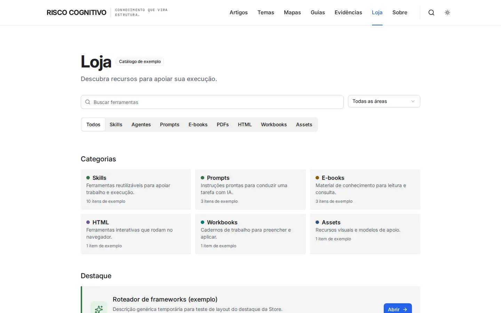 | [antes](screenshots/loja-390-antes.webp) · [depois](screenshots/loja-390-depois.webp) |
| `/admin/design-system/` | 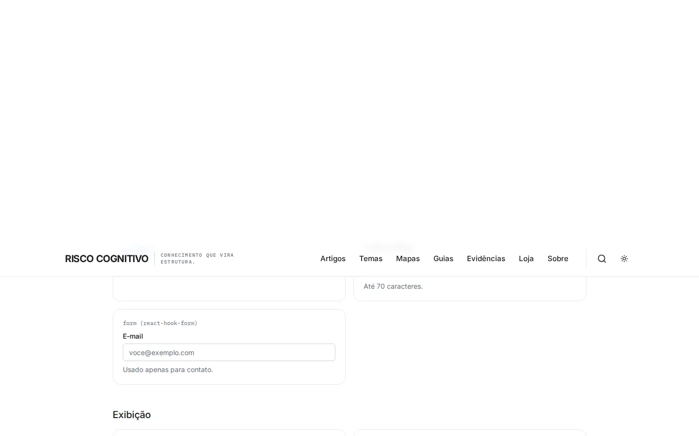 | 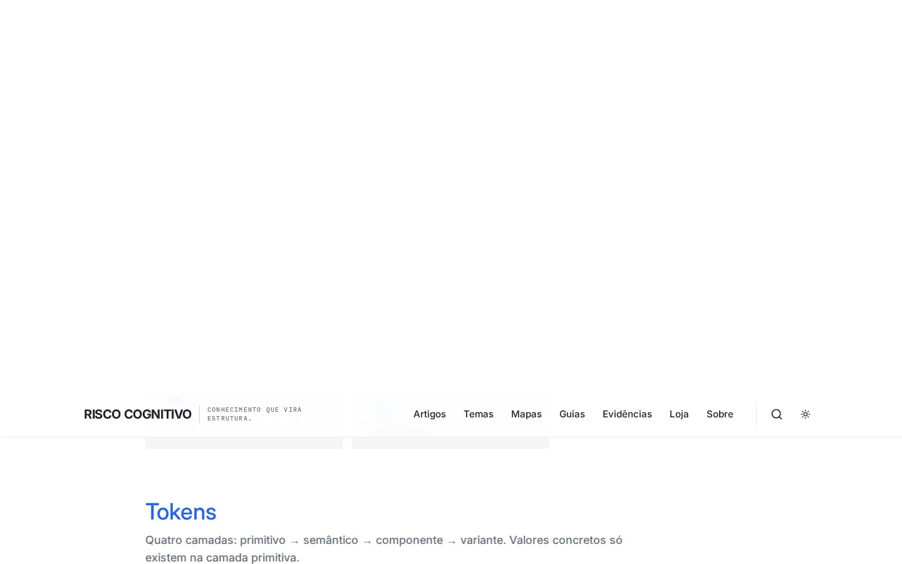 | [antes](screenshots/design-system-390-antes.webp) · [depois](screenshots/design-system-390-depois.webp) |
