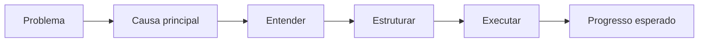

# {{TITULO}}

## 1. Contexto
{{UM_PARAGRAFO_CLARO_ARGUMENTATIVO_PRATICO_COM_EXEMPLO_COTIDIANO}}

## 2. 5W2H

| Variável | Síntese |
|---|---|
| O que? | {{MAX_12_PALAVRAS}} |
| Por quê? | {{MAX_12_PALAVRAS}} |
| Onde? | {{MAX_12_PALAVRAS}} |
| Quando? | {{MAX_12_PALAVRAS}} |
| Quem? | {{MAX_12_PALAVRAS}} |
| Como? | {{MAX_12_PALAVRAS}} |
| Quanto? | {{MAX_12_PALAVRAS}} |

## 3. Referência padrão-ouro
{{UM_PARAGRAFO: QUEM_E + RECONHECIMENTO + CONTRIBUICAO + MUDANCA_NO_CAMPO}}

> “{{CITACAO_OPCIONAL_MAX_12_PALAVRAS}}” — {{FONTE}}

## 4. Problema existente
**Definição.** {{...}}
**Identificação.** {{...}}
**Explicação.** {{...}}
**Fechamento.** {{...}}

## 5. Problema solucionado
**Definição.** {{...}}
**Identificação.** {{...}}
**Explicação.** {{...}}
**Fechamento.** {{...}}

## 6. Processo
1. **Entender:** {{...}}
2. **Estruturar:** {{...}}
3. **Executar:** {{...}}

## 7. Visão do sistema

## 8. Progresso esperado
{{MAX_50_PALAVRAS_COM_DOR + PROCESSO + RESULTADO + EXEMPLO_COTIDIANO}}

## 9. Aviso
{{SOMENTE_SE_NECESSARIO_MAX_30_PALAVRAS}}

## 10. Next 01-02-03
**Next 01 — Entender:** {{ACAO}}
**Next 02 — Estruturar:** {{ACAO}}
**Next 03 — Executar:** {{ACAO}}

## 11. Fontes e aprofundamento
- {{TITULO}} — {{AUTOR_OU_INSTITUICAO}}, {{ANO}} — {{LINK}}
- {{TITULO}} — {{AUTOR_OU_INSTITUICAO}}, {{ANO}} — {{LINK}}

## 12. Infográfico 16:9
**Problema:** {{SINTese + FIGURA}}
**Processo:** {{SINTese + FIGURA}}
**Progresso:** {{SINTese + FIGURA}}
